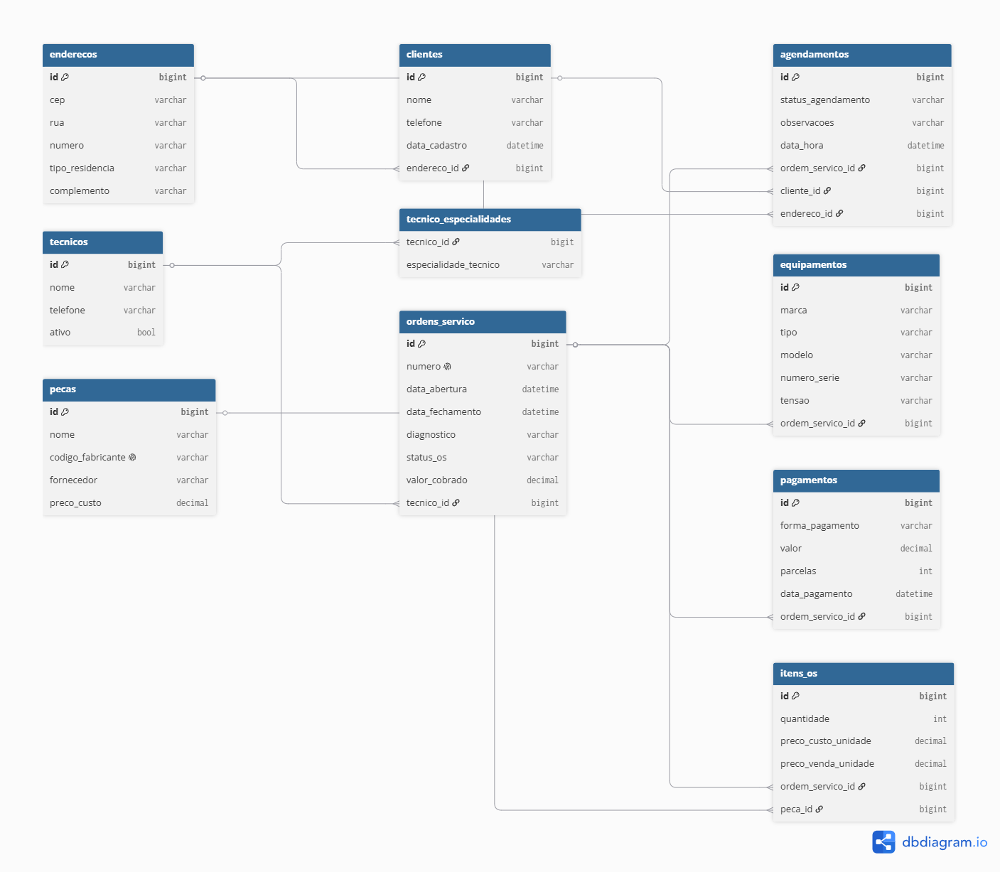

# Sistema de Ordens de Serviço

O sistema foi desenvolvido para auxiliar no fluxo de tomada de decisões
e na organização dos atendimentos realizados por uma assistência técnica
em domicílio.

## Tecnologias
- Java
- Spring Boot
- MySQL
- Maven

## Diagrama de Entidade e Relacionamento
